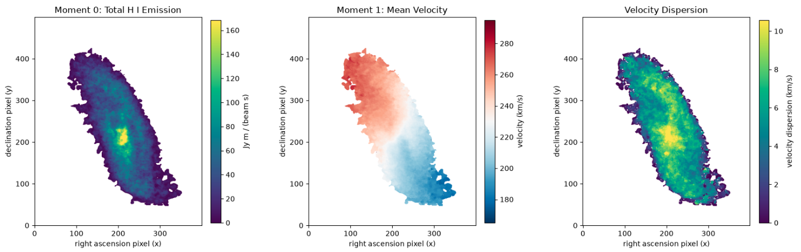
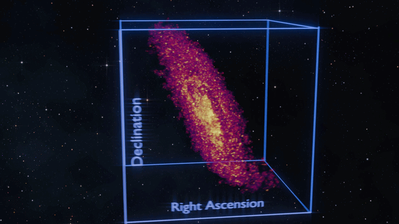

# NGC 3741 - PPV - VIZ
---
### A 3D scientific visualization and animation of NGC 3741 HI 21-cm observations in position-position-velocity space using [VLA-ANGST survey data](https://science.nrao.edu/science/surveys/vla-angst), python and Blender.

> Modern astronomy is data rich. As the volume and dimensionality of data grows, finding new ways to interpret and explore data becomes more prevalent. **This project presents three-dimensional visualization of a position-position-velocity cube utilizing the open-source software Blender after a smooth-and-mask procedure is applied to isolate galaxy emission.** Viewing data typically communicated through numbers and tables in a three-dimensional space can aid in revealing kinematic structures, spatial patterns and anomalies.

> For this project, NGC 3741 was chosen: an irregular dwarf galaxy approximately 10 million light years away from Earth. Though its stellar component is faint and unremarkable, radio observations reveal a disproportionally large neutral hydrogen gas disk. This quantity of hidden mass makes NGC 3741 a valuable subject for studying the nature and distribution of dark matter. **The history the universe, the birth and evolution of galaxies - even the influence of dark matter - can be tangibly represented and understood by astronomers and the general public through 3D visualization.**

## Overview
*For further information view `01_ngc3741_data_inspection.ipynb`*  
 
The data were obtained from the [VLA-ANGST survey](https://science.nrao.edu/science/surveys/vla-angst), an NRAO Large Program that observed the 21 cm line of H I in 35 nearby galaxies within approximately $4\ \mathrm{Mpc}$ [(Ott et al., 2012)](https://ui.adsabs.harvard.edu/abs/2012AJ....144..123O/abstract). This project uses the naturally weighted NGC 3741 data cube as well as official moment maps for comparison purposes. Natural weighting favors sensitivity to faint, extended emission, which is useful for examining NGC 3741's diffuse H I disk, although it provides lower spatial resolution than robust weighting.

The cube is a position–position–velocity (PPV) data product. Its axes correspond to line-of-sight velocity, Declination pixel and Right Ascension pixel, and each voxel records H I flux density in $\mathrm{Jy\,beam^{-1}}$. The velocity axis describes motion along the observer's line of sight rather than physical depth. The released cube is not corrected for primary-beam attenuation and its velocities are expressed relative to the Local Standard of Rest [(Ott et al., 2012;](https://ui.adsabs.harvard.edu/abs/2012AJ....144..123O/abstract) [NRAO, n.d.)](https://science.nrao.edu/science/surveys/vla-angst/data-products).

### Data Products

- `NGC3741_masked_cube.fits` *
- `NGC3741_emission_mask.fits` *
- `NGC3741_moment0.fits`
- `NGC3741_moment1.fits`
- `NGC3741_velocity_dispersion.fits`

*\*Masked cube and boolean emission mask not shown above*

### 3D Scientific Visualization and Animation
The project includes a short film animated and rendered with Blender. The preparation of the final masked cube for export to Blender is detailed in `03_ngc3741_data_export.ipynb`.

*A short GIF from the visualization; emission node strength and color mapping corresponding to an `intensity_display` value*

#### Exports to Blender
- `NGC3741_blender_full.npz`
- `NGC3741_blender_preview.npz`
  
The `numpy` library is required to work with `.npz` files.
The files contain 673200 points and 300000 points respectively. 

## Tools
#### Data Analysis
- Python
- NumPy
- Astropy
- SpectralCube
- SciPy
- Matplotlib
- Jupyter

#### Visualization
- Blender
- Blender Python API
- Geometry Nodes, Shader Nodes
- EEVEE Render Engine
